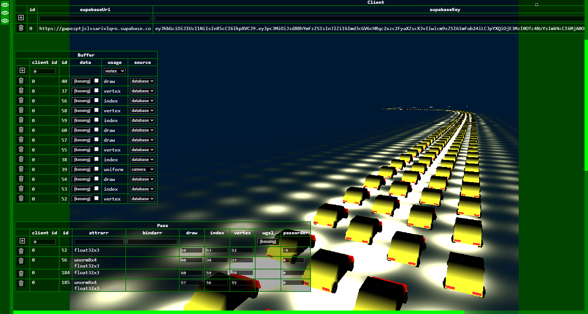
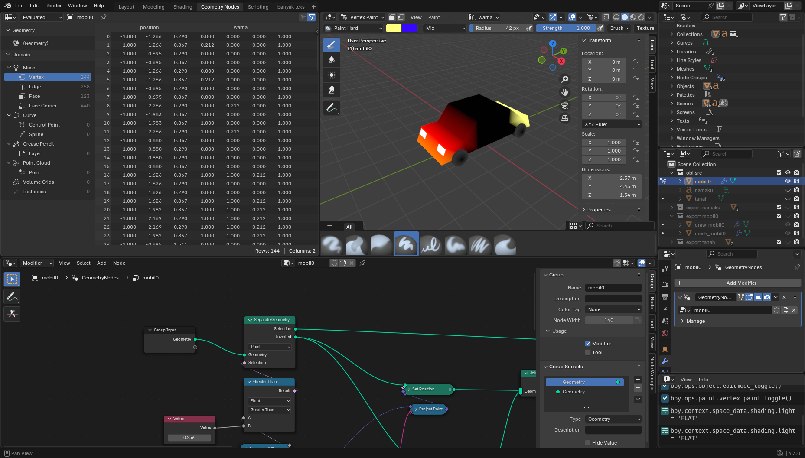
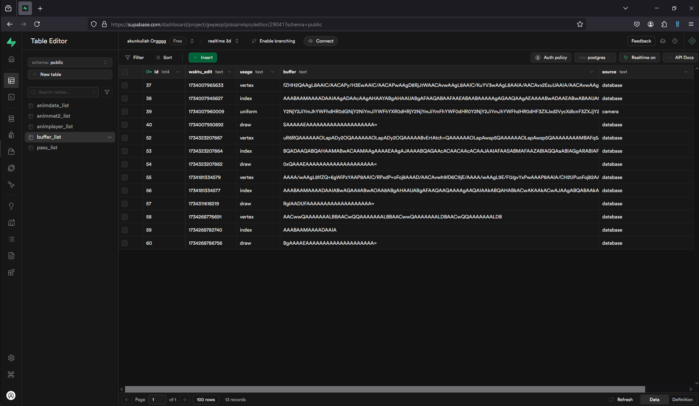

# Poly-Landhep  
  
Objek 3d dengan format texture buatanku sendiri, menampilkan transisi warna yang tajam.
  
### Realtime 3D - Damaskus (work_in_progress)
  
  
Silakan kunjungi [Realtime 3D](https://angkasamuhammad.github.io/Poly-Landhep/Poly%20Landhep/v3/projects/realtime3d/realtime3d.html)  
  
  
Object dibikin menggunakan Blender 4.3.0  
Texture shader bahasa WGSL dibikin menggunakan Notepad++  
  
  
Object dan texture shader disimpan di supabase database  
